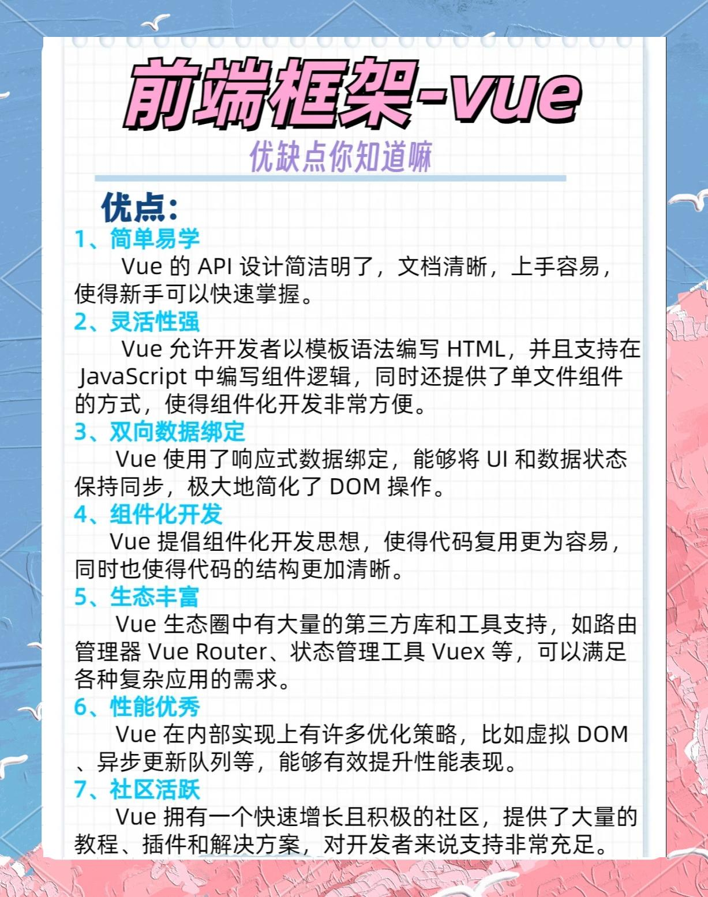
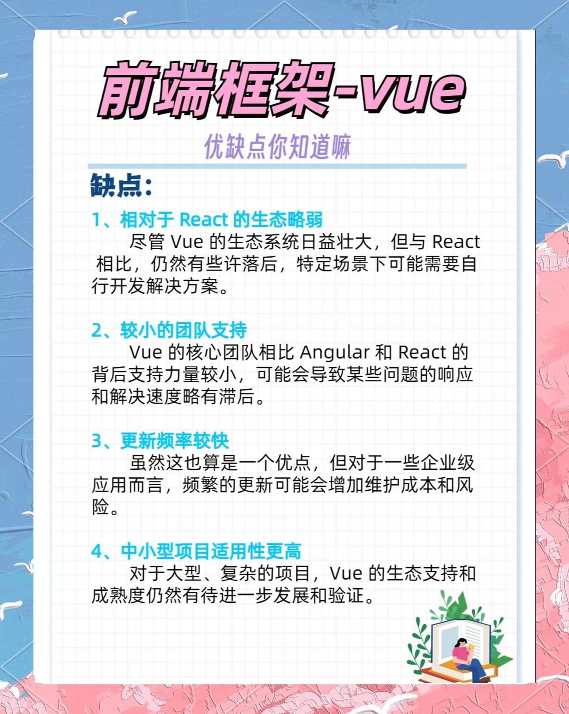
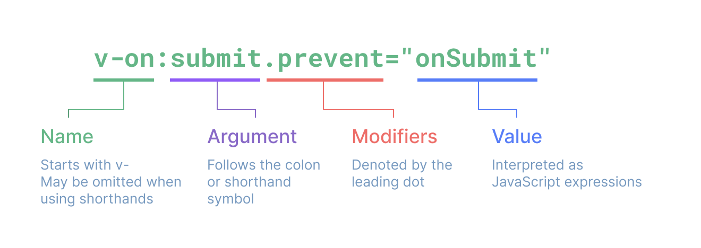

# 学习笔记




## 模版语法

### 文本插值

最基本的数据绑定形式是文本插值，它使用的是“Mustache”语法 (即双大括号)：

`<span>Message: {{ msg }}</span>`

双大括号标签会被替换为相应组件实例中 msg 属性的值。同时每次 msg 属性更改时它也会同步更新。

⚠️ **安全警告**

在网站上动态渲染任意 HTML 是非常危险的，因为这非常容易造成 XSS 漏洞。请仅在内容安全可信时再使用 v-html，并且永远不要使用用户提供的 HTML 内容。


### Attribute 绑定

因为 v-bind 非常常用，我们提供了特定的简写语法：

`<div :id="dynamicId"></div>`

开头为 : 的 attribute 可能和一般的 HTML attribute 看起来不太一样，但它的确是合法的 attribute 名称字符，并且所有支持 Vue 的浏览器都能正确解析它。此外，他们不会出现在最终渲染的 DOM 中。简写语法是可选的，但相信在你了解了它更多的用处后，你应该会更喜欢它。

接下来的指引中，我们都将在示例中使用简写语法，因为这是在实际开发中更常见的用法。

同名简写​(仅支持 3.4 版本及以上)

如果 attribute 的名称与绑定的 JavaScript 值的名称相同，那么可以进一步简化语法，省略 attribute 值：

<!-- 与 :id="id" 相同 -->
`<div :id></div>`

<!-- 这也同样有效 -->
`<div v-bind:id></div>`

这与在 JavaScript 中声明对象时使用的属性简写语法类似。请注意，这是一个只在 Vue 3.4 及以上版本中可用的特性。

### 使用 JavaScript 表达式
**仅支持表达式​**

每个绑定仅支持单一表达式，也就是一段能够被求值的 JavaScript 代码。一个简单的判断方法是**是否可以合法地写在 return 后面**。

因此，下面的例子都是无效的：

```javascript
<!-- 这是一个语句，而非表达式 -->
{{ var a = 1 }}

<!-- 条件控制也不支持，请使用三元表达式 -->
{{ if (ok) { return message } }}
```

### 指令 Directives

```javascript
<form @submit.prevent="onSubmit">...</form>
```

完整的指令语法：

