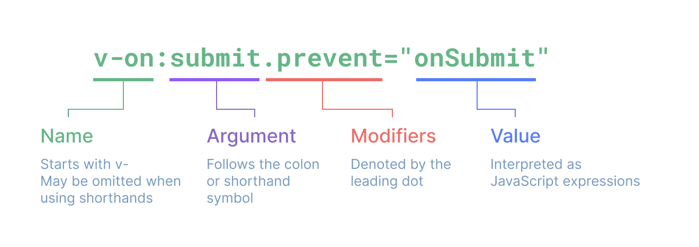

# 学习笔记


## 模版语法

### 文本插值

最基本的数据绑定形式是文本插值，它使用的是“Mustache”语法 (即双大括号)：

`<span>Message: {{ msg }}</span>`

双大括号标签会被替换为相应组件实例中 msg 属性的值。同时每次 msg 属性更改时它也会同步更新。

⚠️ **安全警告**

在网站上动态渲染任意 HTML 是非常危险的，因为这非常容易造成 XSS 漏洞。请仅在内容安全可信时再使用 v-html，并且永远不要使用用户提供的 HTML 内容。

### Attribute 绑定

因为 v-bind 非常常用，我们提供了特定的简写语法：

`<div :id="dynamicId"></div>`

开头为 : 的 attribute 可能和一般的 HTML attribute 看起来不太一样，但它的确是合法的 attribute 名称字符，并且所有支持 Vue 的浏览器都能正确解析它。此外，他们不会出现在最终渲染的 DOM 中。简写语法是可选的，但相信在你了解了它更多的用处后，你应该会更喜欢它。

接下来的指引中，我们都将在示例中使用简写语法，因为这是在实际开发中更常见的用法。

同名简写 ​(仅支持 3.4 版本及以上)

如果 attribute 的名称与绑定的 JavaScript 值的名称相同，那么可以进一步简化语法，省略 attribute 值：

<!-- 与 :id="id" 相同 -->

`<div :id></div>`

<!-- 这也同样有效 -->

`<div v-bind:id></div>`

这与在 JavaScript 中声明对象时使用的属性简写语法类似。请注意，这是一个只在 Vue 3.4 及以上版本中可用的特性。

### 使用 JavaScript 表达式

**仅支持表达式 ​**

每个绑定仅支持单一表达式，也就是一段能够被求值的 JavaScript 代码。一个简单的判断方法是**是否可以合法地写在 return 后面**。

因此，下面的例子都是无效的：

```javascript
<!-- 这是一个语句，而非表达式 -->
{{ var a = 1 }}

<!-- 条件控制也不支持，请使用三元表达式 -->
{{ if (ok) { return message } }}
```

### 指令 Directives

```javascript
<form @submit.prevent="onSubmit">...</form>
```

完整的指令语法：



## 响应式基础

### `<script setup>`

在 setup() 函数中手动暴露大量的状态和方法非常繁琐。幸运的是，我们可以通过使用单文件组件 (SFC) 来避免这种情况。我们可以使用 `<script setup>` 来大幅度地简化代码：

```javascript
<script setup>
import { ref } from 'vue'

const count = ref(0)

function increment() {
  count.value++
}
</script>

<template>
  <button @click="increment">
    {{ count }}
  </button>
</template>
```

#### 单文件组件

在 Vue.js 中，单文件组件（Single File Component，SFC）是指以 .vue 结尾的文件，它将HTML、CSS 和 JavaScript 组合在一起，以模块化的方式构建 Vue 组件。这样，每个组件都能独立维护自己的模板、逻辑和样式，提高开发效率和代码组织性。

#### 为什么要使用 ref？

当你在模板中使用了一个 ref，然后改变了这个 ref 的值时，Vue 会自动检测到这个变化，并且相应地更新 DOM。这是通过一个基于依赖追踪的响应式系统实现的。当一个组件首次渲染时，Vue 会追踪在渲染过程中使用的每一个 ref。然后，当一个 ref 被修改时，它会触发追踪它的组件的一次重新渲染。

在标准的 JavaScript 中，检测普通变量的访问或修改是行不通的。然而，我们可以通过 getter 和 setter 方法来拦截对象属性的 get 和 set 操作。

该 .value 属性给予了 Vue 一个机会来检测 ref 何时被访问或修改。在其内部，Vue 在它的 getter 中执行追踪，在它的 setter 中执行触发。从概念上讲，你可以将 ref 看作是一个像这样的对象：

```javascript
// 伪代码，不是真正的实现
const myRef = {
  _value: 0,
  get value() {
    track()
    return this._value
  },
  set value(newValue) {
    this._value = newValue
    trigger()
  }
}
```

另一个 ref 的好处是，与普通变量不同，你可以将 ref 传递给函数，同时保留对最新值和响应式连接的访问。当将复杂的逻辑重构为可重用的代码时，这将非常有用。

Ref 会使它的值具有深层响应性。这意味着即使改变嵌套对象或数组时，变化也会被检测到。**建议使用 ref() 作为声明响应式状态的主要 API。**


#### 在模板中解包的注意事项​
在模板渲染上下文中，只有顶级的 ref 属性才会被解包。

在下面的例子中，count 和 object 是顶级属性，但 object.id 不是：

```javascript
const count = ref(0)
const object = { id: ref(1) }
```

因此，这个表达式按预期工作：
`{{ count + 1 }}`

...但这个不会：`{{ object.id + 1 }}`

渲染的结果将是 [object Object]1，因为在计算表达式时 object.id 没有被解包，仍然是一个 ref 对象。为了解决这个问题，我们可以将 id 解构为一个顶级属性：

```javascript
const { id } = object
template
{{ id + 1 }}
```

现在渲染的结果将是 2。

另一个需要注意的点是，如果 ref 是文本插值的最终计算值 (即 {{ }} 标签)，那么它将被解包，因此以下内容将渲染为 1：

`{{ object.id }}`

该特性仅仅是文本插值的一个便利特性，等价于 `{{ object.id.value }}`。

## 计算属性

计算属性值会基于其响应式依赖被缓存

#### Getter 不应有副作用​
计算属性的 getter 应只做计算而没有任何其他的副作用，这一点非常重要，请务必牢记。举例来说，不要改变其他状态、在 getter 中做异步请求或者更改 DOM！一个计算属性的声明中描述的是如何根据其他值派生一个值。因此 getter 的职责应该仅为计算和返回该值。

## Tips

### 判断一个网页是用什么前端框架开发的

右键点击网页 → “查看网页源代码”，或者按 Ctrl + U（Windows）/ Cmd + Option + U（Mac），然后搜索关键词，比如：

- Vue.js 可能会有 id="app"，或者 data-v-* 这样的属性。
- React 可能会有 data-reactroot，或者 id="root"。
- Angular 可能会有 ng-* 这样的属性，如 ng-app 或 ng-version。


### 副作用

在 Vue（或者 React 等前端框架）中，副作用（side effect） 指的是会影响组件外部状态或有异步行为的操作，比如 修改 DOM、请求 API、操作本地存储、设置定时器 等。

- 发起 HTTP 请求
- 操作 localStorage / sessionStorage
- 手动修改 DOM
- 监听全局事件（如 window.addEventListener）
- 设置 setTimeout、setInterval
- 修改 Vue 组件之外的变量